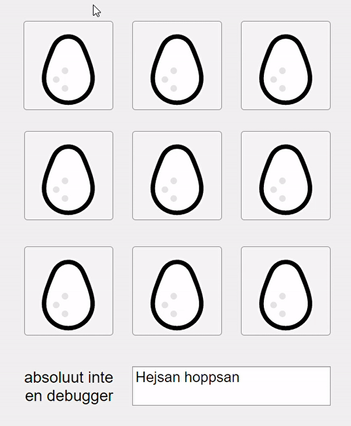

# Duck duck goose

State of the art tic-tac-toe-simulator utulizing (non)artificial intellegence and neural networks (you, the player). Multiplayer if you sit really close and have two mice (and a friend)

### We were so preoccupied with whether or not we could, that we didn't stop to think if we should

designed with the intention of simultaneously being a hardcore gamer whilst clocking in on Ericsson

<video width="320" height="240" controls>
  <source src="UI Figure 2020-12-08 23-41-31.mp4" type="video/mp4">
</video>
